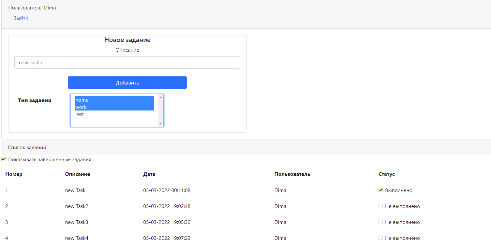
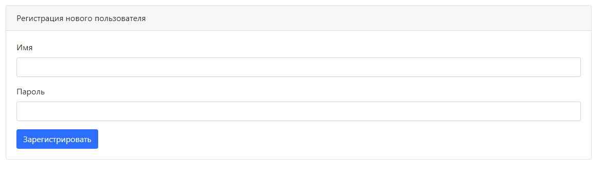

Educational project. Contains exercises for passing the Middle module 
in the course from job4j

The application is a to-do list.
The application has one page with a to-do list index.html .
If the job is done, then it is marked as completed and it disappears from the list.

You can contact me at email darklight1985@mail.ru
Best regards,
Dmitriy Kolesnev.